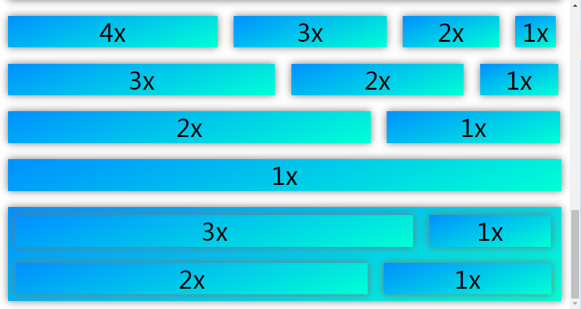

# DanceUI

一款强自适应HTML布局框架，帮助你毫无顾虑的布局HTML页面，而不用担心各种盒模型溢出。

通过这个框架，你可以用几行代码实现这样的效果：


```html
<line>
    <dance width="4h" height="4h">Logo</dance>
    <dance width="1f" height="4h">User Infomation</dance>
</line>

<line>
    <dance width="1.5h" height="1.5h">A</dance>
    <dance width="1f" height="1.5h">Line</dance>
    <dance width="1.5h" height="1.5h">A</dance>
</line>
<!-- 重复四次 -->
```

# 新的盒模型

使用&lt;line&gt;标签创建一个行，然后就可以在里面自由地使用&lt;dance&gt;标签了！&lt;dance&gt;标签是特殊的div，它能保证宽度和高度就是你规定的值，完全不需要担心margin、border和padding！


# 新的单位

DanceUI引入了两个新的单位：标准高度（h）和浮动宽度（f），你可以利用这两个单位创建极其复杂的布局。同一个布局在移动端和PC端都能兼容，变得不再是幻想！




这个框架目前仍在开发中，等待你的参与！

# 关于开源协议

仓库中DanceUI本身(DanceUI.js和DanceUI.css)，以及通过该程序衍生得产品，如Demo视频，均属于开源软件，遵守GNU通用公共许可证，即GNU GPL。

GNU GPL协议授予程序接受人以下权利，或称“自由”：

- 以任何目的运行此程序的自由；

- 再发行复制件的自由；

- 改进此程序，并公开发布改进的自由。

GNU GPL不会授予许可证接受人无限的权利。再发行权的授予需要许可证接受人开放软件的源代码，及所有修改。且复制件、修改版本，都必须以GPL为许可证，这是为了确保任何使用者不会独自占有开源软件。使用、复制或更改DanceUI的程序接受人视为同意GNU GPL协议，必须再次开源其更改后的派生物（如源代码等），否则将追究法律责任。

关于协议版本，DanceUI使用GPL v2协议。

关于GPL v2协议，上述说明仅做参考，具体细节请以LICENSE为准，DanceUI原作者Jackie Lin(用户名lyj00912，<https://github.com/lyj00912> )保留一切解释权。